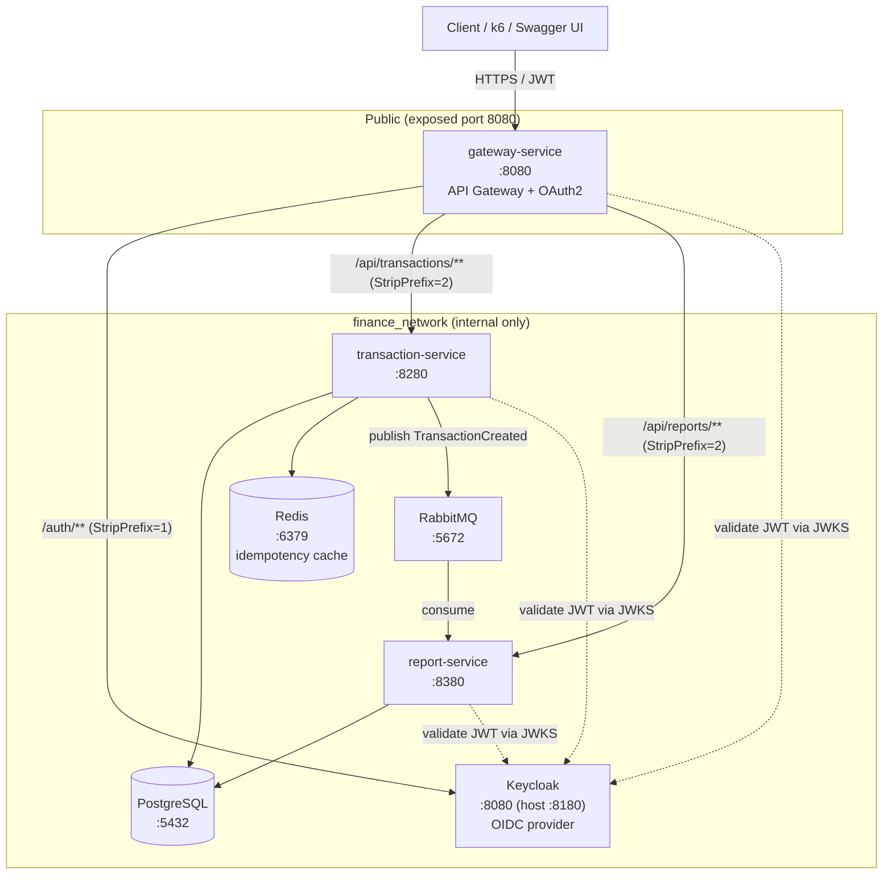
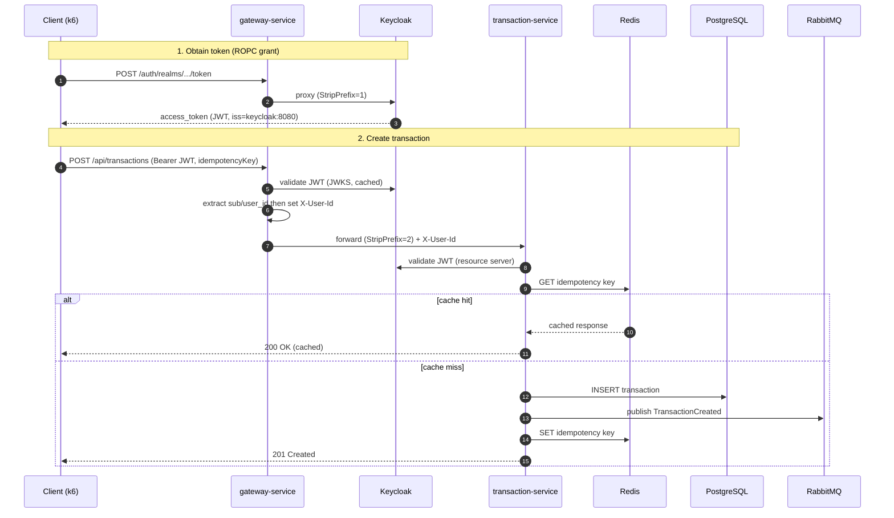
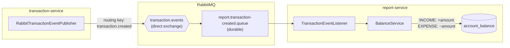
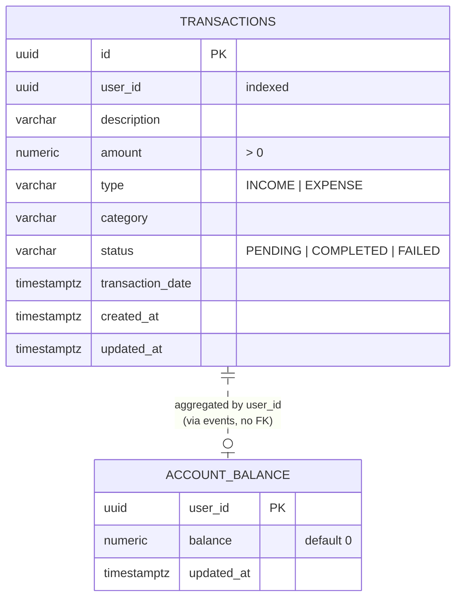
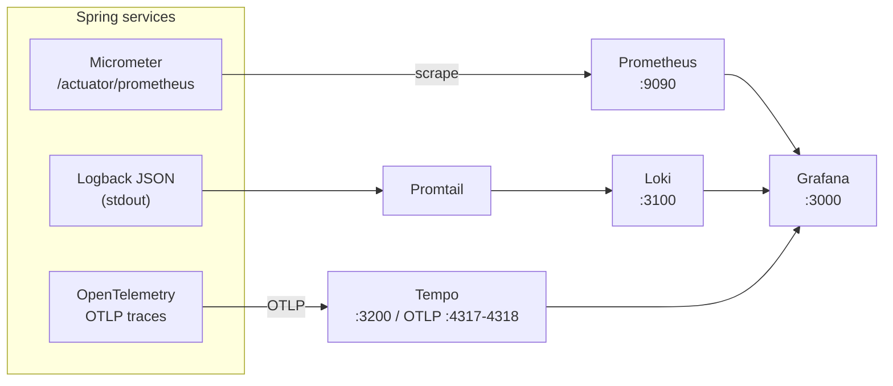

# Finance Tracker — Microservices Platform

A Spring Boot microservices platform for tracking personal finances. Users record income/expense
transactions through an authenticated API gateway; an event-driven report service maintains a
running account balance. Authentication is handled by Keycloak (OAuth2 / OIDC), and the whole stack
ships with a full observability suite (metrics, logs, traces) and a k6 load-testing harness.

> Gradle multi-module project (`finance-tracker-services`) targeting **Java 25** and **Spring Boot 4.0** /
> **Spring Cloud 2025.1**. Despite the repository folder name `transaction-service`, this repo is the
> **monorepo root** containing three services.

---

## Table of contents

- [Architecture](#architecture)
- [Services](#services)
- [Request flow](#request-flow)
- [Event-driven balance updates](#event-driven-balance-updates)
- [Data model](#data-model)
- [Tech stack](#tech-stack)
- [Getting started](#getting-started)
- [API reference](#api-reference)
- [Observability](#observability)
- [Load testing](#load-testing)
- [Project layout](#project-layout)
- [Configuration reference](#configuration-reference)

---

## Architecture

The platform follows an API-gateway pattern. Only the **gateway** is exposed publicly; every other
service sits on a private Docker network (`finance_network`) and is reachable only by service name.



**Key design points**

- **Single entry point.** The gateway is the only container with a published port (`8080`). In the
  production overlay even Keycloak's host port is removed; everything is proxied through `/auth/**`.
- **Trusted-header identity propagation.** The gateway validates the JWT once, extracts the user
  identifier (`user_id` or `sub` claim), and forwards it downstream as the trusted `X-User-Id`
  header. Downstream services read that header instead of re-parsing the token for identity.
- **Defense in depth.** Each downstream service is *also* an OAuth2 resource server and independently
  validates the JWT against Keycloak's issuer/JWKS — the gateway is not the only line of defense.
- **Idempotent writes.** Transaction creation is guarded by a client-supplied `idempotencyKey`
  (UUID), cached in Redis so retried requests return the original result instead of duplicating.
- **Eventual consistency.** Balances are updated asynchronously over RabbitMQ, decoupling the write
  path (transactions) from the read model (reports).

---

## Services

| Service | Port (internal) | Host port | Responsibility |
|---------|-----------------|-----------|----------------|
| **gateway-service** | 8080 | `8080` | Spring Cloud Gateway (MVC). Routing, JWT validation, `X-User-Id` enrichment, aggregated Swagger UI, CORS. |
| **transaction-service** | 8280 | — | Create & list transactions. Idempotency via Redis. Publishes `TransactionCreated` events. |
| **report-service** | 8380 | — | Consumes `TransactionCreated`, maintains per-user `account_balance`. Exposes balance report. |
| **Keycloak** | 8080 | `8180` | OAuth2 / OIDC identity provider. Realm `finance-tracker-realm` auto-imported. |
| **PostgreSQL** | 5432 | `5432` | One database per service (`transaction_service_db`, `report_service_db`, `gateway_db`). |
| **Redis** | 6379 | `6379` | Idempotency-key cache for transaction creation. |
| **RabbitMQ** | 5672 / 15672 | `5672` / `15672` | Message broker for transaction events. |

Each Spring service also exposes a **management port** (`8081` / `8281` / `8381`) for actuator
health, Prometheus metrics, and info — kept separate from the application port.

---

## Request flow

End-to-end sequence for creating a transaction, including authentication and idempotency:



The gateway's identity-propagation filter ([`UserIdHeaderEnrichmentFilter`](gateway-service/src/main/java/com/gateway/gateway/security/UserIdHeaderEnrichmentFilter.java))
rejects any authenticated request whose JWT carries no usable identifier claim, and strips/overwrites
any client-supplied `X-User-Id` so it cannot be spoofed.

---

## Event-driven balance updates

Writing a transaction and updating the user's balance are decoupled through a RabbitMQ
**direct exchange**. The report service owns the read model.



| Element | Value | Defined in |
|---------|-------|-----------|
| Exchange | `transaction.events` (direct, durable) | both services |
| Routing key | `transaction.created` | both services |
| Queue | `report.transaction-created.queue` (durable) | report-service |
| Message format | JSON (`JacksonJsonMessageConverter`) | both services |

On each event, `BalanceService.applyTransaction` applies a signed delta to the user's balance
(`+amount` for `INCOME`, `−amount` for `EXPENSE`) via an atomic upsert.

---

## Data model



The two tables live in **separate databases** (`transaction_service_db` and `report_service_db`) and
are linked only logically by `user_id`. There is no foreign key across the service boundary — the
relationship is maintained asynchronously through events. Schemas are managed by **Flyway**
(`V1__create_transactions.sql`, `V1__create_account_balance.sql`).

---

## Tech stack

| Concern | Technology |
|---------|-----------|
| Language / build | Java 25, Gradle (multi-module), WAR packaging |
| Framework | Spring Boot 4.0, Spring Cloud Gateway 2025.1 (MVC) |
| Security | Spring Security OAuth2 Resource Server, Keycloak 26 (OIDC) |
| Persistence | Spring Data JPA, PostgreSQL 17, Flyway migrations |
| Caching | Redis 7 (idempotency keys) |
| Messaging | RabbitMQ 3.13 (Spring AMQP) |
| Mapping / boilerplate | MapStruct 1.6, Lombok |
| API docs | springdoc-openapi (Swagger UI aggregated at the gateway) |
| Observability | Micrometer + OpenTelemetry, Prometheus, Loki, Tempo, Promtail, Grafana |
| Logging | Logback + logstash-logback-encoder (structured JSON) |
| Testing | JUnit 5, Spring Boot Test, Testcontainers-style H2, JaCoCo (70% min), k6 |

---

## Getting started

### Prerequisites

- Docker & Docker Compose
- JDK 25 (only needed for local non-container builds)
- [k6](https://k6.io/docs/get-started/installation/) (optional, for load testing)

### Run the full stack

The compose project is split across files. `.env` wires them together
(`COMPOSE_FILE=docker-compose.yaml;docker-compose.prod.yml`, `COMPOSE_PROFILES=dev`).

```bash
# Build and start everything (infra + services + observability)
docker compose up -d --build

# Watch service health
docker compose ps

# Tail logs for a single service
docker compose logs -f transaction-service
```

> **First boot is slow.** Keycloak runs `start-dev --import-realm` and can take ~2–3 minutes to
> become healthy while it imports the realm. The Spring services have a 120s health-check
> `start_period` for the same reason. Wait for `gateway-service` to be up before sending traffic.

### Compose file layout

| File | Purpose |
|------|---------|
| `docker-compose.yaml` | Base definition of all services, networks, volumes. |
| `docker-compose.dev.yml` | `dev` profile — runs infra (Postgres, Redis, RabbitMQ, Keycloak) for running services from the IDE. |
| `docker-compose.prod.yml` | `prod` overlay — pulls published images, sets resource limits, removes public ports except the gateway and Grafana. |

### Build locally (without Docker)

```bash
./gradlew clean build              # build + test all modules
./gradlew :transaction-service:bootRun
./gradlew aggregateJacocoReport    # combined coverage report
```

---

## API reference

All endpoints are reached through the gateway at `http://localhost:8080`. Every `/api/**` call
requires a valid `Bearer` token. `X-User-Id` is injected by the gateway — clients never send it.

### Authentication (proxied to Keycloak)

```
POST /auth/realms/finance-tracker-realm/protocol/openid-connect/token
Content-Type: application/x-www-form-urlencoded

grant_type=password&client_id=k6-test-client&client_secret=k6-test-secret&username=admin&password=admin123&scope=openid
```

### Transactions

| Method | Path | Description | Notable headers |
|--------|------|-------------|-----------------|
| `POST` | `/api/transactions/transactions` | Create a transaction. Returns `201` (created) or `200` (idempotent cache hit). | `idempotencyKey` (UUID, **required**) |
| `GET` | `/api/transactions/transactions?page=&size=` | List the caller's transactions (paginated). | — |

**Create request body**

```json
{
  "description": "Monthly salary",
  "amount": 5000.00,
  "category": "WORK",
  "type": "INCOME",
  "transactionDate": "2026-05-24T15:30:00Z"
}
```

Validation: `description`/`category` non-blank, `amount` ≥ 0.01, `type` ∈ {`INCOME`, `EXPENSE`},
`transactionDate` required, `idempotencyKey` must match a UUID pattern.

### Reports

| Method | Path | Description |
|--------|------|-------------|
| `GET` | `/api/reports/reports` | Get the caller's current account balance. |

### Swagger UI

Aggregated docs for all three services are served by the gateway:
**http://localhost:8080/swagger-ui.html** (with Keycloak OAuth2 / PKCE login wired in).

---

## Observability

The stack is fully instrumented. Metrics, logs, and traces are correlated by trace ID.



| Tool | URL | Role |
|------|-----|------|
| **Grafana** | http://localhost:3000 (`admin`/`admin`) | Dashboards — single pane of glass |
| **Prometheus** | http://localhost:9090 | Metrics scraping & queries |
| **Loki** | http://localhost:3100 | Log aggregation |
| **Tempo** | http://localhost:3200 | Distributed tracing (OTLP `:4317`/`:4318`) |
| **RabbitMQ mgmt** | http://localhost:15672 | Queue/exchange inspection |

Each service uses a `TraceLoggingFilter` to attach trace/span IDs to structured logs, so a request
can be followed across the gateway → transaction-service → RabbitMQ → report-service hop in Grafana.

---

## Load testing

A [k6](k6/load-test.js) script drives the API through the gateway with realistic mixed workloads.
It authenticates via Keycloak (ROPC grant with `k6-test-client`), caches tokens per VU, and tests
creates, paginated reads, and idempotency replays.

```bash
# from the repo root
k6 run k6/load-test.js                          # default: "mixed" scenario
k6 run --env SCENARIO=smoke   k6/load-test.js   # 1 VU sanity check
k6 run --env SCENARIO=load    k6/load-test.js   # ramp to 20 VUs
k6 run --env SCENARIO=spike   k6/load-test.js   # burst to 50 VUs
k6 run --env SCENARIO=soak    k6/load-test.js   # 15 VUs for 10 min
k6 run --env BASE_URL=http://localhost:8080 k6/load-test.js
```

| Scenario | Profile |
|----------|---------|
| `smoke` | 1 VU, 1 iteration — quick sanity check |
| `load`  | ramp to 20 VUs (creates) + 10 VUs (lists), hold 3 min |
| `spike` | sudden burst to 50 VUs |
| `soak`  | 15 VUs sustained for 10 min (mixed) |
| `mixed` *(default)* | income + expense + paginated reads + idempotency, concurrently |

The script's `setup()` polls Keycloak's OIDC discovery endpoint before any VU runs, so a run started
during cold start fails fast with a clear message instead of cryptic `500`s.

**SLO thresholds enforced by the script**

| Metric | Threshold |
|--------|-----------|
| `auth_token_duration` | p95 < 1000 ms |
| `transaction_create_duration` | p95 < 800 ms |
| `transaction_list_duration` | p95 < 500 ms |
| `transaction_create_success_rate` | > 95% |
| `transaction_list_success_rate` | > 98% |
| `http_req_failed` | < 5% |

---

## Project layout

```
finance-tracker-services/
├── docker-compose.yaml          # base stack definition
├── docker-compose.dev.yml       # dev profile (infra only)
├── docker-compose.prod.yml      # prod overlay (images, limits, locked-down ports)
├── build.gradle                 # root build: Java 25, JaCoCo, aggregate reports
├── settings.gradle              # modules: gateway, transaction, report
├── init.sql                     # creates the three per-service databases
├── gateway-service/             # API gateway + OAuth2 + X-User-Id enrichment
│   └── src/main/java/com/gateway/gateway/
│       ├── security/            # security config, UserIdHeaderEnrichmentFilter
│       └── openapi/             # aggregated Swagger config
├── transaction-service/         # write side — transactions
│   └── src/main/java/com/transaction/transactionservice/
│       ├── controller/  service/  repository/  entity/
│       ├── event/               # RabbitMQ publisher
│       ├── config/              # Redis, RabbitMQ, Security, OpenAPI
│       └── exception/           # GlobalExceptionHandler
├── report-service/              # read side — balances (event consumer)
│   └── src/main/java/com/reportservice/reportservice/
│       ├── controller/  service/  repository/  entity/
│       └── event/listener/      # RabbitMQ listener
├── keycloak/import/             # auto-imported realm (finance-tracker-realm)
├── observability/               # prometheus / loki / tempo / promtail / grafana configs
└── k6/load-test.js              # load/perf testing harness
```

---

## Configuration reference

Key environment variables (defaults shown; set via compose or `.env`):

| Variable | Used by | Default | Purpose |
|----------|---------|---------|---------|
| `KEYCLOAK_ISSUER_URI` | all services | `http://localhost:8180/realms/finance-tracker-realm` | Expected JWT issuer (must equal the token's `iss` claim) |
| `KEYCLOAK_JWK_SET_URI` | all services | `http://keycloak:8080/realms/finance-tracker-realm/protocol/openid-connect/certs` | Where services fetch signing keys (internal network) |
| `KEYCLOAK_REALM` | all services | `finance-tracker-realm` | Realm name |
| `KEYCLOAK_PUBLIC_URL` | all services | `http://localhost:8180` | Browser-facing Keycloak base URL (Swagger auth/token) |
| `KEYCLOAK_SERVICE_URI` | gateway | `http://keycloak:8080` | Proxy target for `/auth/**` |
| `TRANSACTION_SERVICE_URI` | gateway | `http://transaction-service:8280` | Routing target |
| `REPORT_SERVICE_URI` | gateway | `http://report-service:8380` | Routing target |
| `DB_HOST` / `DB_PORT` / `DB_NAME` | tx / report | `postgres` / `5432` / per-service db | PostgreSQL connection |
| `REDIS_HOST` / `REDIS_PORT` | transaction | `redis` / `6379` | Idempotency cache |
| `RABBITMQ_HOST` / `RABBITMQ_PORT` | tx / report | `rabbitmq` / `5672` | Event broker |
| `TEMPO_HOST` | all services | `tempo` | OTLP trace export target |
| `CORS_ALLOWED_ORIGINS` | gateway | `localhost:3000,4200,5173` | Allowed browser origins |

> **Important:** Keycloak stamps the token's `iss` claim with whatever hostname was used to
> request the token. Because tokens are obtained from the host browser (`localhost:8180`) but the
> backend services run inside Docker (`keycloak:8080`), the two names never match and you get
> blanket `401`s (`The iss claim is not valid`).
>
> The fix (already wired up): Keycloak pins its public issuer with `KC_HOSTNAME=http://localhost:8180`
> and `KC_HOSTNAME_BACKCHANNEL_DYNAMIC=true`, so **every** token carries `iss=http://localhost:8180/...`
> regardless of access path. Each service then validates that fixed issuer (`KEYCLOAK_ISSUER_URI`)
> while fetching signing keys over the internal network (`KEYCLOAK_JWK_SET_URI` →
> `http://keycloak:8080/...`). Spring uses the explicit `jwk-set-uri` for the decoder and validates
> the `iss` claim against `issuer-uri` without doing OIDC discovery, so the issuer string never needs
> to be network-reachable from inside the containers.

---

## Default credentials (development only)

| What | Value |
|------|-------|
| Keycloak admin | `admin` / `admin123` |
| App test user | `admin` / `admin123` (realm `finance-tracker-realm`) |
| k6 OAuth client | `k6-test-client` / `k6-test-secret` (ROPC / direct access grants) |
| Grafana | `admin` / `admin` |
| PostgreSQL | `root` / `root` |

These are seeded for local development. **Do not use them in production.**
